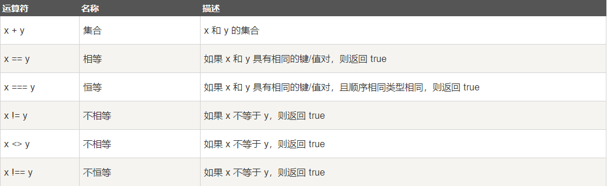
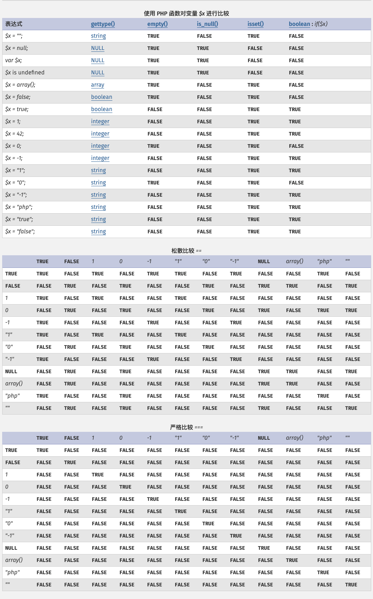

# 一、变量

## 1. 局部变量与全局变量

1.要在一个函数中访问一个全局变量，需要使用 global 关键字；
2.PHP 将所有全局变量存储在一个名为 $GLOBALS[index] 的数组中。 index 保存变量的名称。这个数组可以在函数内部访问，也可以直接用来更新全局变量；

<!--more-->
### 示例
```
<?php
$x = 5;
$y = 10;

function test()
{
    global $x, $y;
    $y = $x + $y;
    echo $y;
}

echo $y;        // 10
test();         // 15
echo $y;        // 15
```

## 2. static作用域

当一个函数完成时，它的所有变量通常都会被删除，第一次声明变量时使用 static 关键字，该局部变量便不会被删除；每次调用该函数时，该变量将会保留着函数前一次被调用时的值；（该变量仍然是函数的局部变量）

<!--more-->
### 示例
```
<?php
$x = 5;
$y = 10;

function test()
{
    static $x = 0;
    echo $x;
    $x++;
    echo PHP_EOL;   // 换行符
}

test();         // 0
test();         // 1
test();         // 2
```

## 3. 参数作用域

参数是通过调用代码将值传递给函数的局部变量（参数是在参数列表中声明的，作为函数声明的一部分）

<!--more-->

## 4. PHP EOF

1.必须后接分号，否则编译通不过；
2.EOF 可以用任意其它字符代替，只需保证结束标识与开始标识一致；
3.结束标识必须顶格独自占一行(即必须从行首开始，前后不能衔接任何空白和字符)；
4.开始标识可以不带引号或带单双引号，不带引号与带双引号效果一致，解释内嵌的变量和转义符号，带单引号则不解释内嵌的变量和转义符号；
5.当内容需要内嵌引号（单引号或双引号）时，不需要加转义符，本身对单双引号转义，此处相当与q和qq的用法；
6.位于开始标记和结束标记之间的变量可以被正常解析，但是函数则不可以；

<!--more-->
### 示例
```
<?php
$name="lzc";
$a= <<<EOF
        "abc"$name
        "123"
EOF;

echo $a;
```

# 二、echo 和 print 语句

1.echo - 可以输出一个或多个字符串，print - 只允许输出一个字符串，返回值总为 1；
2.echo 输出的速度比 print 快， echo 没有返回值，print有返回值1；



# 三、常量

1.常量在定义后，默认是全局变量，可以在整个运行的脚本的任何地方使用；
2.设置常量，使用 define() 函数


### 示例
```
// 区分大小写的常量名
define("GREETING", "欢迎访问 Runoob.com");

// 不区分大小写的常量名
define("GREETING", "欢迎访问 Runoob.com", true);
```

# 四、运算符
## 1.太空船运算符
```
$c = $a <=> $b;

// 如果 $a > $b, 则 $c 的值为 1
// 如果 $a == $b, 则 $c 的值为 0
// 如果 $a < $b, 则 $c 的值为 -1
```

## 2.数组运算符
```
$x = array("a" => "red", "b" => "green");
$y = array("c" => "blue", "d" => "yellow");
$z = $x + $y; // $x 和 $y 数组合并
var_dump($z);
var_dump($x == $y);
var_dump($x === $y);
var_dump($x != $y);
var_dump($x <> $y);
var_dump($x !== $y);
// -------
array(4) { ["a"]=> string(3) "red" ["b"]=> string(5) "green" ["c"]=> string(4) "blue" ["d"]=> string(6) "yellow" }
bool(false)
bool(false)
bool(true)
bool(true)
bool(true)
```


## 3.各种数据类型比较
```
0 == false: bool(true)0 === false: bool(false)
0 == null: bool(true)0 === null: bool(false)
false == null: bool(true)false === null: bool(false)
"0" == false: bool(true)"0" === false: bool(false)
"0" == null: bool(false)"0" === null: bool(false)
"" == false: bool(true)"" === false: bool(false)
"" == null: bool(true)"" === null: bool(false)
```



# 五、switch语句
```
switch ($n) {
    case 1:
        // Todo
        break;
    default:
        // Todo
}
```

# 六、超级全局变量

$GLOBALS;       // 包含了全部变量的全局组合数组。变量的名字就是数组的键
$_SERVER;       // 服务器信息
$_REQUEST;      // 表单提交的数据
$_POST;         // 表单数据
$_GET;          // 表单数据
$_FILES;
$_ENV;          // 环境变量
$_COOKIE;
$_SESSION;


# 七、命名空间
### 1.可在同一个文件中定义不同的命名空间代码：
```
<?php
namespace MyProject {
    const CONNECT_OK = 1;
    class Connection { /* ... */ }
    function connect() { /* ... */  }
}

namespace AnotherProject {
    const CONNECT_OK = 1;
    class Connection { /* ... */ }
    function connect() { /* ... */  }
}
```

### 2.将全局的非命名空间中的代码与命名空间中的代码组合在一起，只能使用大括号形式的语法。全局代码必须用一个不带名称的 namespace 语句加上大括号括起来：
```
<?php
namespace MyProject {
    const CONNECT_OK = 1;
    class Connection { /* ... */ }
    function connect() { /* ... */  }
}

// 全局代码
namespace {
    session_start();
    $a = MyProject\connect();
    echo MyProject\Connection::start();
}
```

### 3.在声明命名空间之前唯一合法的代码是用于定义源文件编码方式的 declare 语句。所有非 PHP 代码包括空白符都不能出现在命名空间的声明之前：
```
<?php
declare(encoding='UTF-8'); //定义多个命名空间和不包含在命名空间中的代码
namespace MyProject
```

# 八、面向对象

1.多态 => 多态性是指相同的函数或方法可作用于多种类型的对象上并获得不同的结果。不同的对象，收到同一消息可以产生不同的结果，这种现象称为多态性
2.重载 => 函数或者方法有同样的名称，但是参数列表不相同的情形，这样的同名不同参数的函数或者方法之间，互相称之为重载函数或者方法
3.抽象性 => 抽象性是指将具有一致的数据结构（属性）和行为（操作）的对象抽象成类
4.析构函数（__destruct） => 当对象结束其生命周期时（例如对象所在的函数已调用完毕），系统自动执行析构函数。析构函数往往用来做"清理善后" 的工作
5.public => 公有的类成员可以在任何地方被访问
6.protected => 受保护的类成员则可以被其自身以及其子类和父类访问
7.private => 私有的类成员则只能被其定义所在的类访问
8.任何一个类，如果它里面至少有一个方法是被声明为抽象的，那么这个类就必须被声明为抽象的
9.抽象类不能被实例化
10.抽象类的抽象方法只是申明的调用参数，不能定义其具体的功能实现
11.继承一个抽象类的时候，子类必须定义父类中的所有抽象方法；另外，这些方法的访问控制必须和父类中一样（或者更为宽松）
12.子类方法可以包含父类抽象方法中不存在的可选参数
13.如果父类中的方法被声明为 final，则子类无法覆盖该方法。如果一个类被声明为 final，则不能被继承


